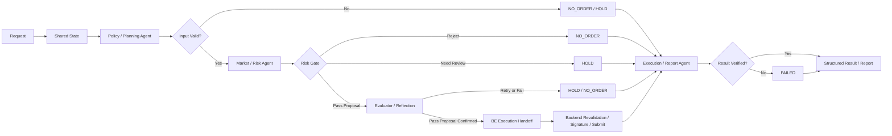

# Coin Agent AI / Agent 개발 명세

## 문서 목적

이 문서는 LangGraph 기반 Coin Agent AI 계층을 **단순 Prompt Chaining이 아니라 상태 기반 Agentic Orchestration**으로 구현하기 위한 기준을 정의한다. 각 Agent는 Binance Spot Testnet 기반 주문 테스트 흐름에서 독립적인 판단 책임, 검증 책임, 실패 기본값을 가지며, 모든 실행은 안전 제약과 리스크 게이트를 통과한 경우에만 Backend로 전달된다.

## 관련 문서

- 요구사항: `SPEC.md`
- 시스템 구조: `ARCHITECTURE.md`
- 데이터 계약: `DATA.md`
- 테스트 기준: `TEST_AND_DEMO.md`

## 1. AI 계층의 역할

AI 계층은 Binance Spot Testnet의 시세, 잔고, 주문 결과를 바탕으로 사용자의 테스트 요청을 구조화하고, 주문 가능 여부를 판단하며, 결과를 설명하는 역할을 한다. 다만 AI는 **직접 주문을 제출하는 계층이 아니며**, BE가 제공한 정규화 데이터만 해석하고, 최종 실행 여부는 BE의 재검증과 서명 처리 이후에만 확정된다.

AI 계층의 목적은 다음 네 가지다.

1. 사용자 입력을 구조화된 주문 테스트 의도로 정규화한다.
2. 시장 상태, 잔고, 거래소 제약, 프로젝트 정책을 근거로 허용/차단/보류를 판단한다.
3. 실행 전후 판단 근거를 구조화된 trace로 남긴다.
4. 주문 결과, 차단 사유, fallback 방향을 사람이 이해할 수 있게 설명한다.

## 2. Agentic 설계 원칙

- **Stateful**: 각 Agent는 공유 상태를 읽고 제한된 필드만 쓴다.
- **Fail-Closed**: 불확실하거나 필수 근거가 부족하면 기본값은 `NO_ORDER` 또는 `HOLD`다.
- **Reasoning With Artifacts**: 사고 과정은 자유 서술형 프롬프트가 아니라 `reason_codes`, `evidence_refs`, `verification_checks`, `final_action` 같은 구조화 결과로 남긴다.
- **Deterministic Guard First**: 심볼 형식, 필수 파라미터, 수량/가격 규칙, 실거래 차단은 룰 엔진이 우선한다.
- **Human-Review Ready**: 주문 제출 직전 또는 불확실성이 남는 경우 사람이 개입할 수 있도록 `HOLD` 상태를 유지한다.
- **Schema-Enforced Outputs**: 각 노드의 산출물은 이름 있는 schema를 따라야 하며, schema mismatch는 무시하지 않는다.
- **No Secret Handling**: AI는 API Key, Secret, signature, timestamp 생성 책임을 가지지 않는다.
- **Single Authority for Execution**: Binance 제출 권한은 BE만 가진다.

## 3. 런타임 주체와 권한 경계

| 주체 | 책임 | 할 수 있는 일 | 하면 안 되는 일 |
|---|---|---|---|
| User | 주문 테스트 요청, 상태 조회 요청 | 구조화 입력 제공, 결과 확인 | 실거래 요청을 정상 범위로 간주하게 만들기 |
| FE | 입력/시각화 | 구조화 요청 전송, 결과 표시 | Binance 직접 호출, 서명 생성 |
| BE | 실행 권한자 | Binance REST/WS 호출, signature 생성, 최종 재검증 | AI 판단만 믿고 무검증 제출 |
| AI Orchestrator | 상태 기반 판단 조정 | Agent 실행 순서 제어, 상태 전이 관리 | 거래소 직접 호출, 실거래 우회 |
| Policy/Planning Agent | 입력 정규화 | 요청 구조화, 누락 파라미터 식별 | 시장 위험 허용 판단 단독 확정 |
| Market/Risk Agent | 위험 판단 | 시장/잔고/거래 제약 검증, gate 결정 | 서명 생성, 주문 제출 |
| Execution/Report Agent | 실행 해석 | BE 결과 검증, 보고서 생성 | 자체적으로 주문 확정 또는 재시도 |

## 4. 통합 Orchestrator 구조



이 구조에서 Agentic AI의 핵심은 단순히 노드가 여러 개인 것이 아니라, 각 노드가 **자신의 판단 산출물을 다음 노드가 검증 가능한 형태로 넘기고**, 하나의 `run_id` 아래에서 상태를 이어가며, 중간 상태가 `NO_ORDER`, `HOLD`, `READY_FOR_BE`, `BE_REJECTED`, `REPORT_READY` 같은 전이 규칙을 가진다는 점이다. Policy 단계는 정책 artifact를 조회해 `policy_context`로 고정하고, Risk 단계는 그 컨텍스트를 근거로 `PASS` 또는 `HOLD`를 제안하며, Evaluator 단계는 그 제안이 충분히 근거화되었는지만 다시 본다. 그 뒤에도 최종 실행 여부는 항상 BE가 deterministic 재검증으로 확정한다. BE는 동일 run을 resume하는 방식으로 결과를 다시 주입하며, 독립된 두 번의 무상태 AI 호출 체인으로 구현하지 않는다.

## 5. Shared State 계약

공유 상태는 단순 필드 모음이 아니라 Agent 간 계약이다. 각 필드는 소유자, 쓰기 권한, 불변 조건을 가진다.

| 필드 | 설명 | 주 작성자 | 주 소비자 | 불변/제약 |
|---|---|---|---|---|
| `request_context` | 사용자 원본 요청, request id, 호출 시각 | FE/BE | 전체 | 원본 입력은 보존한다 |
| `policy_context` | policy retrieval로 모은 허용 심볼, 허용 주문 타입, 최대 수량/금액, 시간대 정책, 정책 artifact reference | BE | Policy, Risk, Evaluator | AI가 정책 자체를 완화하지 않는다 |
| `normalized_order_intent` | 구조화된 주문 테스트 의도 | Policy | Risk, Execution | 필수 필드 누락 시 `incomplete=true` |
| `market_snapshot` | 현재가, 호가, 캔들 요약 | BE | Risk, Report | Binance 원본을 정규화해 전달 |
| `account_balance` | 잔고 및 거래 가능 상태 | BE | Risk, Report | signed endpoint 결과만 반영 |
| `exchange_rules` | `exchangeInfo` 기반 제약 | BE | Risk | `PRICE_FILTER`, `LOT_SIZE`, `MIN_NOTIONAL` 포함 |
| `risk_assessment` | 위험 평가 결과 | Risk | Execution, Report | 정량 검증과 reason code를 함께 가진다 |
| `gate_decision` | `PASS`, `REJECT`, `HOLD` | Risk | BE, Report | Risk Agent만 작성 가능 |
| `evaluation_result` | evaluator score, retry 여부, reflection 메모 | Evaluator | BE, Execution, Report | evaluator는 실행 여부를 결정하지 않는다 |
| `execution_request` | BE로 넘길 최종 요청 초안 | Orchestrator | BE, Execution | AI는 서명 필드를 포함하지 않는다 |
| `execution_result` | 주문 응답, 상태 조회 결과, 취소 결과 | BE | Execution | Binance 제출 이후에만 생성 |
| `verification_checks` | 입력/리스크/실행 결과 검증 목록 | 각 Agent | 전체 | 각 단계가 자신의 검증만 추가 |
| `decision_trace` | `reason_codes`, `evidence_refs`, `final_action`, `notes` | 각 Agent | Report, Audit | 자유 문장보다 구조화 우선 |
| `hold_reason` | `HOLD`의 세부 원인 | Policy, Risk, BE | FE, Execution, Audit | `HOLD_REVIEW_REQUIRED`, `HOLD_DATA_INSUFFICIENT` 중 하나 |
| `errors` | 에러 코드와 실패 위치 | 전체 | 전체 | 예외는 누락하지 않고 누적 |
| `lifecycle_status` | 현재 상태 | Orchestrator | 전체 | 아래 상태 집합만 사용 |

### 5.1 Shared State merge / reducer 기준

| 필드 | merge 방식 | 비고 |
|---|---|---|
| `request_context` | immutable | 최초 요청 이후 변경 금지 |
| `policy_context` | immutable | BE가 시작 시점에만 주입 |
| `normalized_order_intent` | 최초 생성 후 보완 병합 | 보완 입력이 필요한 경우 누락 필드만 채움 |
| `market_snapshot` | latest overwrite | 재조회 시 최신 스냅샷으로 대체 |
| `account_balance` | latest overwrite | signed 조회 최신값 우선 |
| `exchange_rules` | latest overwrite | `exchangeInfo` 최신값 우선 |
| `risk_assessment` | stage overwrite | Risk 단계 최신 산출물 1개 유지 |
| `gate_decision` | stage overwrite | Risk 단계 최신 산출물 1개 유지 |
| `evaluation_result` | stage overwrite | evaluator 최신 산출물 1개 유지 |
| `verification_checks` | append | 단계별 결과 누적 |
| `decision_trace` | agent-key merge | `policy`, `risk`, `evaluator`, `execution`, `run_summary`를 키 단위로 병합 |
| `hold_reason` | latest overwrite | `HOLD` 상태일 때만 필수 |
| `errors` | append | 에러 누적, 삭제 금지 |
| `lifecycle_status` | state transition only | 허용된 전이만 가능 |

## 6. 상태 전이 기준

| 상태 | 의미 | 다음 가능 상태 |
|---|---|---|
| `RECEIVED` | BE가 요청을 수신함 | `NORMALIZING`, `FAILED` |
| `NORMALIZING` | Policy Agent가 의도를 정규화 중 | `NEEDS_INPUT`, `RISK_REVIEW`, `NO_ORDER` |
| `NEEDS_INPUT` | 필수 값 누락 또는 해석 불가인 내부 상태 | `NO_ORDER`, `HOLD`, `RISK_REVIEW` |
| `RISK_REVIEW` | Risk Agent가 시장/잔고/규칙 검증 중 | `READY_FOR_BE`, `HOLD`, `NO_ORDER` |
| `HOLD` | 사람 검토 또는 추가 데이터 필요 | `RISK_REVIEW`, `NO_ORDER`, `READY_FOR_BE` |
| `READY_FOR_BE` | AI 기준 통과, BE 재검증 대기 | `BE_REJECTED`, `EXECUTING` |
| `BE_REJECTED` | BE deterministic 재검증 단계에서 차단 | `REPORT_READY` |
| `EXECUTING` | Binance Testnet 제출 및 응답 대기 | `RESULT_VERIFYING`, `FAILED` |
| `RESULT_VERIFYING` | Execution Agent가 응답 의미를 검증 중 | `REPORT_READY`, `FAILED` |
| `REPORT_READY` | 사용자용 결과 설명 준비 완료 | 종료 |
| `NO_ORDER` | 신규 주문 생성 없이 종료 | 종료 |
| `FAILED` | 기술 실패 또는 복구 불가 상태 | 종료 |

상태 전이의 기본 규칙은 다음과 같다.

- `PASS`는 `READY_FOR_BE`를 의미할 뿐, 곧바로 주문 제출을 의미하지 않는다.
- `READY_FOR_BE`는 BE deterministic revalidation 직전의 AI-side handoff 상태일 뿐이며, execution approval이나 execution complete를 뜻하지 않는다.
- `HOLD`는 애매하지만 위험한 상태를 숨기지 않고 드러내기 위한 안전 상태다.
- `HOLD`에서 `READY_FOR_BE`로 가는 전이는 같은 `run_id`의 resume 이후 보완 입력 또는 승인 결과를 병합하고 막혀 있던 검증 경로를 다시 통과한 경우에만 허용되며, resume 자체가 직접 승격을 의미하지는 않는다.
- `BE_REJECTED`는 AI가 통과시켰더라도 BE가 deterministic 검증으로 다시 차단할 수 있음을 의미하며, 이 상태는 BE만 생성할 수 있다.
- `BE_REJECTED`는 차단 결과를 설명하는 핵심 상태이며, 사용자용 보고 payload 생성 이후 내부 lifecycle은 `REPORT_READY`로 진행할 수 있다.

### 6.1 HOLD subtype 해석 기준

| hold_reason | 의미 | FE/BE 처리 |
|---|---|---|
| `HOLD_REVIEW_REQUIRED` | 정책상 자동 진행이 부적절해 사람 승인 또는 명시적 확인이 필요한 상태 | 승인/거절 UI 또는 관리자 확인 절차 제공 |
| `HOLD_DATA_INSUFFICIENT` | 시장 데이터, 정책 입력, 응답 필수 필드가 부족해 재조회 또는 보완 입력이 필요한 상태 | 재조회/재입력 후 같은 `run_id` resume |

`HOLD`는 lifecycle 상태이고, `hold_reason`은 그 상태의 원인을 설명하는 세부 계약이다.

## 7. Agent별 계약

### 7.1 Policy / Planning Agent

#### 역할

- 사용자 입력을 주문 테스트 의도로 정규화한다.
- BE가 조회해 전달한 정책 artifact를 묶어 `policy_context`로 해석한다.
- 주문 타입별 필수 필드를 채우거나 누락 여부를 표기한다.
- 구조화된 `action proposal`을 만든 뒤 다음 단계로 넘길 근거를 남긴다.
- 해석 불가능한 요청을 실행 요청으로 승격하지 않는다.

#### 입력

- `request_context`
- `policy_context`

`policy_context`는 빈 설명 필드가 아니라, BE가 retrieval한 정책 artifact 집합이다. 예를 들면 허용 심볼 목록, 주문 타입 허용 범위, 최대 notion/수량 정책, 시간대 제한, 사람 승인 필요 조건, 관련 정책 문서 reference가 여기에 들어간다. Policy Agent는 정책 원문을 임의로 완화하지 않고, retrieval된 artifact를 근거 source로 사용한다.

#### 출력

- `normalized_order_intent`
- `action proposal` 성격의 구조화 초안, 단 `PASS` 또는 실행 확정이 아니라 다음 단계 검토용 제안
- `verification_checks.input_validation`
- `decision_trace.policy`
- 필요 시 `errors`

여기서 `action proposal`은 별도 실행 권한 객체가 아니라, `normalized_order_intent`, `decision_trace.policy`, 이후 생성될 `execution_request`의 기반이 되는 제안 묶음이다. 최소한 주문 방향, 주문 타입, 필수 파라미터 충족 여부, 정책 근거 reference, 사람이 다시 봐야 할 포인트를 포함해야 한다.

#### Reasoning 책임

- 요청이 조회인지 주문 테스트인지 분류한다.
- `MARKET` / `LIMIT` 주문인지 판별한다.
- `quantity`, `quoteOrderQty`, `price`, `timeInForce` 중 무엇이 필요한지 결정한다.
- 정책 artifact에서 어떤 제한이 실제로 적용되는지 골라 `policy_context` 근거를 연결한다.
- 다음 단계가 바로 검증할 수 있게 `evidence_refs`와 `verification_checks`를 남긴다.
- 누락된 값이 있으면 억지로 추론하지 않고 `NEEDS_INPUT` 또는 `NO_ORDER`로 보낸다.

#### 검증 항목

- 심볼 형식이 대문자 REST 심볼 규칙을 만족하는가
- 주문 타입별 필수 필드가 있는가
- 정책상 허용된 주문 타입/심볼인가
- 입력이 실거래로 오해될 표현을 포함하는가

#### 금지 사항

- 잔고 충분 여부를 단독 확정하지 않는다.
- 시장 데이터 없이 가격 타당성을 추정하지 않는다.
- 누락된 필드를 추측으로 채우지 않는다.

#### 종료 기준

- 구조화 가능한 경우: `normalized_order_intent`와 근거가 포함된 `action proposal` 초안을 남기고 `RISK_REVIEW`
- 필수 값 누락: 내부 상태로 `NEEDS_INPUT`을 기록한 뒤 `NO_ORDER` 또는 `HOLD`
- 명백한 금지 요청: `NO_ORDER`

#### 허용 도구 / 계약

| 도구 | 목적 | 출력 schema |
|---|---|---|
| `normalize_order_request` | 구조화 주문 의도 생성 | `NormalizedOrderIntent` |
| `validate_order_fields` | 주문 타입별 필수 필드 검증 | `VerificationResult[]` |
| `classify_request_type` | 조회/주문/상태조회/취소 구분 | `request_type` 문자열 |
| `map_policy_context_evidence` | BE가 주입한 `policy_context` 안에서 실제 적용 정책 근거를 선택하고 연결 | `evidence_refs`, `VerificationResult[]` |
| `detect_disallowed_live_trading_terms` | 실거래 전환 시도 감지 | `VerificationResult[]` |

### 7.2 Market / Risk Agent

#### 역할

- 시장 데이터, 잔고, 거래소 규칙, 프로젝트 정책을 근거로 주문 허용/차단/보류를 결정한다.
- Risk Gate의 유일한 작성자다.

#### 입력

- `normalized_order_intent`
- `policy_context`
- `market_snapshot`
- `account_balance`
- `exchange_rules`

#### 출력

- `risk_assessment`
- `gate_decision`
- `verification_checks.risk_validation`
- `decision_trace.risk`

#### Reasoning 책임

- 주문 요청이 정책 범위 안에 있는지 해석한다.
- 잔고, 최소 수량, 최소 notion, tick/step size를 검토한다.
- 시장가/지정가 각각에 대해 충분한 근거가 있는지 판단한다.
- 실패 사유를 `reason_codes`로 구조화한다.

#### Gate 기준

- `PASS`: 필수 파라미터, 정책, 잔고, 거래소 규칙, Testnet 제약을 모두 충족
- `REJECT`: 규칙 위반 또는 명백한 안전 위반
- `HOLD`: 데이터가 오래되었거나 애매해서 자동 진행이 부적절함

여기서 `PASS`는 실행 결론이 아니라 **BE로 넘겨도 되는 action proposal 후보**라는 뜻이다. 즉 `READY_FOR_BE`는 BE가 deterministic rule verdict를 내리기 전의 AI 측 통과 상태다.

#### 금지 사항

- `PASS`를 실행 완료로 해석하지 않는다.
- 정책을 우회하거나 완화하지 않는다.
- BE의 재검증 책임을 대체하지 않는다.

#### 종료 기준

- `PASS`: evaluator 입력용 후보 제안 생성
- `REJECT`: `NO_ORDER`
- `HOLD`: `HOLD`

#### 허용 도구 / 계약

| 도구 | 목적 | 출력 schema |
|---|---|---|
| `evaluate_market_snapshot` | 시세/호가/캔들 요약 해석 | `RiskAssessment` |
| `validate_exchange_rules` | `PRICE_FILTER`, `LOT_SIZE`, `MIN_NOTIONAL` 검증 | `VerificationResult[]` |
| `check_policy_limits` | 정책상 최대 수량/금액/시간대 검증 | `VerificationResult[]` |
| `assess_hold_reason` | 보류가 필요한 경우 subtype 결정 | `HoldDecision` |

### 7.3 Evaluator / Reflection Agent

#### 역할

- Policy와 Risk 단계가 남긴 구조화 근거가 충분한지 재검토한다.
- `PASS` 제안이 근거 부족, 정책 artifact 누락, self-contradiction 없이 전달 가능한지 점수화한다.
- 점수가 낮으면 재시도, 보류, 차단 전이 중 하나를 선택하게 한다.

#### 입력

- `policy_context`
- `normalized_order_intent`
- `risk_assessment`
- `gate_decision`
- `verification_checks`
- `decision_trace.policy`
- `decision_trace.risk`

#### 출력

- `evaluation_result`
- `verification_checks.evaluation_validation`
- `decision_trace.evaluator`

#### 평가 대상

- `policy_context`가 실제 적용 정책을 충분히 포함하는가
- `normalized_order_intent`와 `risk_assessment` 사이에 모순이 없는가
- `gate_decision=PASS` 근거가 `reason_codes`, `evidence_refs`, `verification_checks`로 재현 가능한가
- `HOLD` 또는 `REJECT`로 내려야 할 사유가 누락되지 않았는가
- 다음 단계인 BE가 deterministic 검증을 수행할 수 있을 만큼 evidence가 구조화되어 있는가

#### score / retry 기준

- score owner는 **Evaluator Agent**다. 이 점수는 품질 점수이며 실행 권한 점수가 아니다.
- `score >= 0.85`: `PASS` proposal 유지 가능, `READY_FOR_BE` 후보로 전달
- `0.60 <= score < 0.85`: 1회 reflection retry 허용, 누락 근거를 보강한 뒤 재평가
- `score < 0.60`: `HOLD` 또는 `NO_ORDER`로 전환 검토
- retry는 같은 `run_id` 안에서만 수행하며, 정책 완화나 임의 추정으로 score를 올리면 안 된다.

#### 실패 전이 기준

- 정책 artifact reference 누락, evidence mismatch, trace self-contradiction: `HOLD` 또는 `NO_ORDER`
- `gate_decision=PASS`인데 필수 검증 항목이 비어 있음: `HOLD`
- 반복 retry 후에도 score 기준 미달: `HOLD` 또는 `NO_ORDER`
- evaluator schema mismatch: `FAILED` 또는 `HOLD` + `hold_reason=HOLD_DATA_INSUFFICIENT`

#### 금지 사항

- evaluator score를 실행 승인으로 해석하지 않는다.
- BE 대신 deterministic rule verdict를 내리지 않는다.
- 정책을 새로 만들거나 기존 정책을 완화하지 않는다.

#### 종료 기준

- score 기준 충족 + 근거 충분: `READY_FOR_BE` 후보 유지
- score 기준 미달 + 보완 가능: `HOLD`
- score 기준 미달 + 복구 불가: `NO_ORDER`

### 7.4 Execution / Report Agent

#### 역할

- BE가 재검증 후 제출한 결과를 해석한다.
- 주문 응답, 상태 조회 결과, 취소 결과의 의미를 검증한다.
- 사용자용 설명과 저장용 보고 payload를 생성한다.

#### 입력

- `normalized_order_intent`
- `gate_decision`
- `risk_assessment`
- `evaluation_result`
- `execution_request` (있는 경우)
- `execution_result` (주문 제출이 발생한 경우)
- `errors`

#### 출력

- `verification_checks.execution_validation`
- `decision_trace.execution`
- `report_payload`
- `lifecycle_status=REPORT_READY`

#### Reasoning 책임

- 주문이 차단되거나 보류된 경우 그 이유를 사용자 관점으로 설명한다.
- BE가 받은 결과가 AI가 전달한 의도와 모순되지 않는지 확인한다.
- evaluator score와 BE 최종 verdict가 다른 경우 override 이유를 함께 설명한다.
- `NEW`, `FILLED`, `PARTIALLY_FILLED`, `CANCELED`, `REJECTED`, `EXPIRED` 상태를 사용자 관점으로 해석한다.
- 주문 실패와 주문 차단을 구분해 설명한다.

#### 금지 사항

- 재시도를 자동 결정하지 않는다.
- 실패한 주문을 다른 조건으로 바꿔 다시 제출하라고 지시하지 않는다.
- 실거래 전략 조언을 생성하지 않는다.

#### 종료 기준

- 응답 검증 성공: `REPORT_READY`
- 응답 불일치 또는 필수 필드 결손: `FAILED`

#### 허용 도구 / 계약

| 도구 | 목적 | 출력 schema |
|---|---|---|
| `validate_execution_result` | 주문 응답/상태 응답 검증 | `VerificationResult[]` |
| `build_report_payload` | 사용자용 리포트 조립 | `ReportPayload` |
| `summarize_block_or_failure` | 차단/실패 설명 | `AgentDecisionTrace` |

### 7.5 Resume payload와 immutable 규칙

resume 시점에는 다음 규칙을 따른다.

- immutable: `request_context`, 최초 `policy_context`, 이전 단계 `decision_trace`, 과거 `errors`
- patch 가능: `market_snapshot`, `account_balance`, `execution_result`, 보완 입력 필드, 사용자 승인 결과
- `run_summary`는 최종 상태가 결정되기 전까지 확정하지 않는다.
- resume payload는 반드시 `run_id`, `resume_reason`, `patch_fields`를 포함해야 한다.

## 8. Agent Reasoning / Thinking 설계

이 문서에서 말하는 Reasoning은 숨겨진 장문 사고를 의미하지 않는다. 구현 기준은 **검증 가능한 사고 산출물**이다.

각 Agent는 최소한 다음 구조를 남겨야 한다.

- `reason_codes`: 차단/허용/보류 근거 코드
- `evidence_refs`: 어떤 입력 필드, 시장 데이터, 거래소 규칙을 근거로 썼는지
- `verification_checks`: 무엇을 확인했고 통과/실패했는지
- `final_action`: `NEEDS_INPUT`, `NO_ORDER`, `HOLD`, `READY_FOR_BE`, `BE_REJECTED`, `REPORT_READY`, `FAILED` 중 현재 단계 결론

예시:

```json
{
  "reason_codes": ["LIMIT_PRICE_REQUIRED", "INSUFFICIENT_BALANCE"],
  "evidence_refs": ["normalized_order_intent.type", "account_balance.balances[USDT]"],
  "verification_checks": [
    {"name": "required_fields", "result": "fail"},
    {"name": "balance_check", "result": "fail"}
  ],
  "final_action": "NO_ORDER"
}
```

이 구조는 Agent가 “생각했다”는 사실보다, **왜 그런 결론이 나왔는지 나중에 검토 가능하게 만드는 것**에 목적이 있다.

또한 trace는 한 개의 평면 객체로 끝나지 않고, 최소한 다음처럼 Agent별로 구분 가능해야 한다.

- `decision_trace.policy`
- `decision_trace.risk`
- `decision_trace.evaluator`
- `decision_trace.execution`
- `decision_trace.run_summary`

`run_summary`에는 최종 상태와 BE override 여부를 남기고, 각 agent trace에는 해당 단계에서만 생성된 `reason_codes`와 `verification_checks`를 남긴다.

### 8.1 Structured output 계약

각 노드는 아래 이름 있는 schema를 따라야 한다.

- Policy Node → `NormalizedOrderIntent`, `AgentDecisionTrace`
- Risk Node → `RiskAssessment`, `GateDecision`, `HoldDecision`
- Evaluator Node → `EvaluationResult`, `AgentDecisionTrace`
- Execution Node → `VerificationResult[]`, `AgentDecisionTrace`
- Report Node → `ReportPayload`, `RunDecisionTrace`

schema mismatch 처리 기준은 다음과 같다.

- 필수 필드 누락 + 보완 가능 → `HOLD` + `hold_reason=HOLD_DATA_INSUFFICIENT`
- 필수 필드 누락 + 의미 복구 불가 → `NO_ORDER` 또는 `FAILED`
- 금지 값/실거래 흔적 포함 → `NO_ORDER`

## 9. 리스크 게이트와 안전 제약

### 9.1 Hard Guardrails

아래 항목은 하나라도 위반하면 즉시 `NO_ORDER`다.

- 실거래 URL 또는 실거래 키 사용 정황
- Binance Production host 문자열 사용
- 정책상 금지된 심볼 또는 주문 타입
- 사용자가 명시적으로 제공했어야 하는 필수 파라미터가 모순되거나 복구 불가능하게 누락됨
- 서명/인증 책임을 AI에게 넘기려는 시도

### 9.2 Risk Gate Checks

- 심볼 형식이 Binance Spot 심볼 규칙을 만족하는가
- `MARKET` / `LIMIT` 타입별 필수 파라미터가 있는가
- 잔고가 충분한가
- `PRICE_FILTER`, `LOT_SIZE`, `MIN_NOTIONAL`을 만족하는가
- 시장 데이터가 너무 오래되지 않았는가
- 프로젝트 정책의 최대 수량/금액/시간대 조건을 넘지 않는가
- 구조화 출력 schema가 다음 단계에서 해석 가능한가

### 9.3 BE 재검증 원칙

- AI의 `PASS`는 제안일 뿐 확정이 아니다.
- evaluator 고득점 역시 BE에 대한 proposal 강화일 뿐, 실행 결정이 아니다.
- BE는 주문 제출 직전에 동일 제약을 deterministic하게 다시 검증한다.
- BE는 필요 시 AI의 `PASS`를 `BE_REJECTED`로 낮출 수 있다.
- `BE_REJECTED`는 BE 재검증 단계에서만 생성된다.

### 9.4 Tool boundary 원칙

- AI는 Binance REST/WS를 직접 호출하지 않는다.
- AI가 사용하는 도구는 BE 또는 내부 런타임이 제공하는 정규화 도구여야 한다.
- tool output은 모두 `DATA.md`의 이름 있는 schema에 매핑되어야 한다.

## 10. LLM 사용 지점과 룰 엔진 사용 지점

### LLM 사용 지점

- 입력 의도 구조화
- 애매한 요청의 분류와 보류 판단
- 주문 결과 설명
- 에러 해석 요약
- 테스트 리포트 생성
- `HOLD_REVIEW_REQUIRED` vs `HOLD_DATA_INSUFFICIENT` 판별

### 룰 엔진 사용 지점

- 필수 파라미터 검증
- 심볼 형식 검증
- 주문 타입별 필수 필드 검증
- `exchangeInfo` 기반 수량/가격/notional 검증
- 실거래 URL/키 차단
- BE 제출 직전 재검증

원칙은 “LLM이 이해를 돕고, 룰 엔진이 경계를 고정한다”이다.

## 11. 실패 처리와 복구 기본값

- 파라미터 누락(보완 가능): `HOLD` + `hold_reason=HOLD_DATA_INSUFFICIENT`
- 파라미터 누락(복구 불가): `NO_ORDER`
- 시그니처 실패: `FAILED`
- 잔고 부족: `NO_ORDER`
- 거래소 규칙 위반: `NO_ORDER`
- API 실패: `FAILED`
- stream 실패: 수동 조회 fallback 안내
- 응답 필수 필드 누락: `FAILED`
- Agent 판단 근거 부족: `HOLD`
- schema mismatch: `FAILED` 또는 `HOLD` + `hold_reason=HOLD_DATA_INSUFFICIENT`

복구 원칙은 다음과 같다.

- 기술적 일시 오류는 BE 레벨에서만 제한적으로 재시도할 수 있다.
- 의미적 오류나 정책 위반은 재시도하지 않는다.
- 실패 후에도 `decision_trace`와 `errors`는 남긴다.

## 12. 보고와 감사 추적 기준

AI가 최종적으로 남겨야 하는 보고 산출물은 다음을 포함한다.

- 요청 유형: 조회 / 주문 테스트 / 상태 조회 / 취소
- 최종 상태: `NEEDS_INPUT`, `NO_ORDER`, `HOLD`, `BE_REJECTED`, `REPORT_READY`, `FAILED`
- gate 결과와 핵심 `reason_codes`
- 사용된 주요 근거 필드
- 주문이 제출된 경우 Binance 응답의 핵심 필드
- 사용자에게 보여줄 자연어 설명

### 12.1 보고 단위와 cadence

- 기본 보고 단위는 1 `run_id` 다.
- 단계 보고 단위는 policy, risk, evaluator, execution, run_summary trace 다.
- 중간 보고 cadence는 request accepted, policy retrieval complete, policy complete, risk gate complete, evaluator complete, BE revalidation complete, final report ready 순서를 따른다.
- `HOLD`가 발생하면 cadence는 다음 진행 대신 같은 `run_id`의 resume 대기 상태로 멈춘다.

보고 cadence에서 사람 검토 경계는 다음과 같다.

- `HOLD_REVIEW_REQUIRED`가 발생하면 사람 검토가 다음 단계의 필수 입력이 된다.
- evaluator가 근거 부족으로 낮은 점수를 준 경우 사람은 score 자체를 승인하는 주체가 아니라, 보완 입력 또는 진행 중단을 결정하는 주체다.
- `READY_FOR_BE`와 evaluator 통과 이후에도 주문 제출 여부는 사람이나 AI가 아니라 BE deterministic rule verdict가 최종 확정한다.

`NEEDS_INPUT`은 내부 상태이지만, 외부 보고에서는 보통 `HOLD` 또는 `NO_ORDER` 설명으로 매핑된다. 다만 audit trace에는 내부 상태 그대로 남길 수 있다.

자연어 설명은 다음 원칙을 따른다.

- 주문 차단 사유와 주문 실패 사유를 구분한다.
- 실거래를 연상시키는 표현을 쓰지 않는다.
- 수익 보장, 매수 유도, 공격적 투자 표현을 쓰지 않는다.
- 불확실하면 “추가 확인이 필요하다”로 설명하고 주문을 만들지 않는다.

## 13. 노드 입력/출력 기준

| 노드 | 입력 | 출력 |
|---|---|---|
| Policy Node | 사용자 요청, 정책 컨텍스트 | `NormalizedOrderIntent`, 입력 검증 결과, `AgentDecisionTrace` |
| Risk Node | 구조화 주문 의도, 시장 데이터, 잔고, 거래소 규칙 | `RiskAssessment`, `GateDecision`, `HoldDecision` |
| BE Handoff | gate 통과 요청 | 재검증된 실행 요청 또는 `BE_REJECTED` |
| Execution Node | BE 실행 결과 | `VerificationResult[]`, `AgentDecisionTrace` |
| Report Node | 실행 결과/차단 결과/실패 결과 | `ReportPayload`, `RunDecisionTrace` |

## 14. 평가 기준

- 요청 구조화 정확성
- 파라미터 차단 정확성
- gate 결정 근거의 추적 가능성
- 주문 결과 설명의 명확성
- 에러 코드 해석 일관성
- 실거래 방지 문구 유지 여부
- BE 재검증과 AI 판단 경계가 문서상 분명한지

### 14.1 최소 평가 시나리오

| 시나리오 | 기대 gate | 기대 최종 상태 |
|---|---|---|
| 필수 파라미터 누락 | `REJECT` 또는 `HOLD` | `NO_ORDER` 또는 `HOLD` + `hold_reason=HOLD_DATA_INSUFFICIENT` |
| 잔고 부족 | `REJECT` | `NO_ORDER` |
| stale market data | `HOLD` | `HOLD` + `hold_reason=HOLD_DATA_INSUFFICIENT` |
| 사람 승인 필요 정책 | `HOLD` | `HOLD` + `hold_reason=HOLD_REVIEW_REQUIRED` |
| BE 재검증 실패 | `PASS` | `BE_REJECTED` |
| execution_result schema mismatch | `PASS` | `FAILED` |

## 15. 확정 구현 기준

- 자연어 정책 입력은 제외하고 폼/구조화 입력만 지원한다.
- 주문 허용 판단은 룰 엔진 우선으로 처리한다.
- AI는 설명과 요약에 집중하되, 구조화 의도와 gate trace를 함께 남긴다.
- AI는 거래소 시그니처를 생성하지 않는다.
- AI는 Binance에 직접 요청하지 않는다.
- AI는 실거래 전환 로직을 갖지 않는다.
- 사람 승인 또는 추가 확인이 필요한 경우 `HOLD`를 유지한다.
- `HOLD` 상태에는 반드시 `hold_reason`가 함께 기록되어야 한다.
- shared state merge 규칙과 node output schema는 문서상 이름으로 고정되어야 한다.