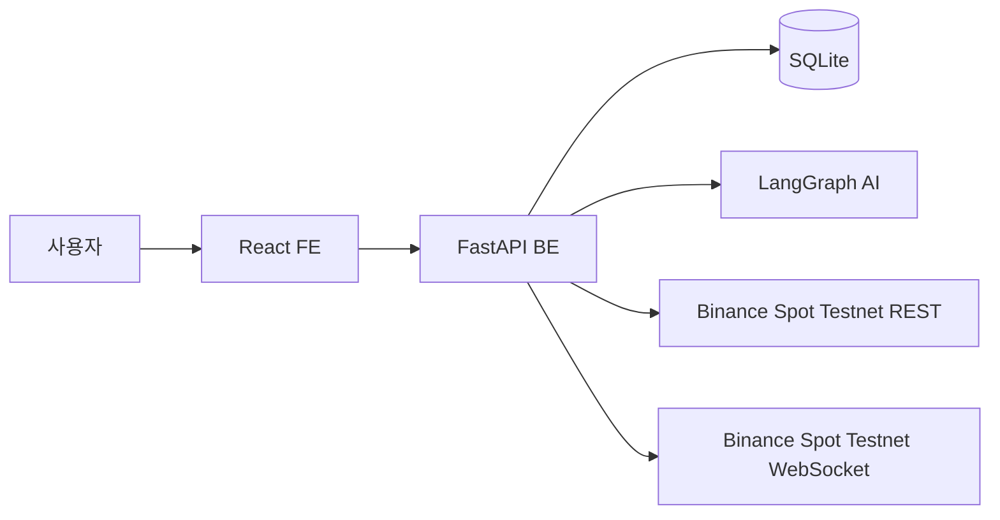
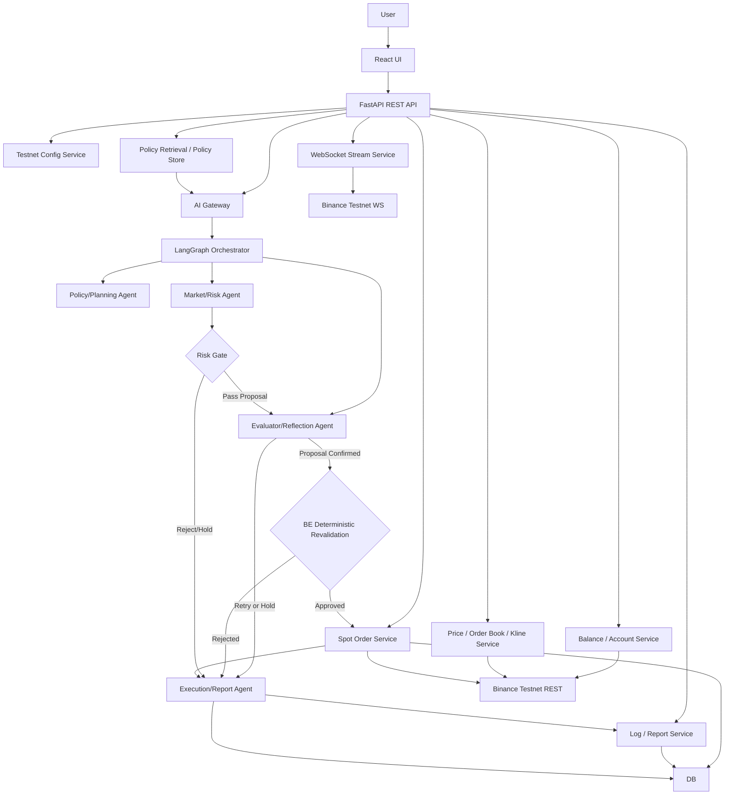
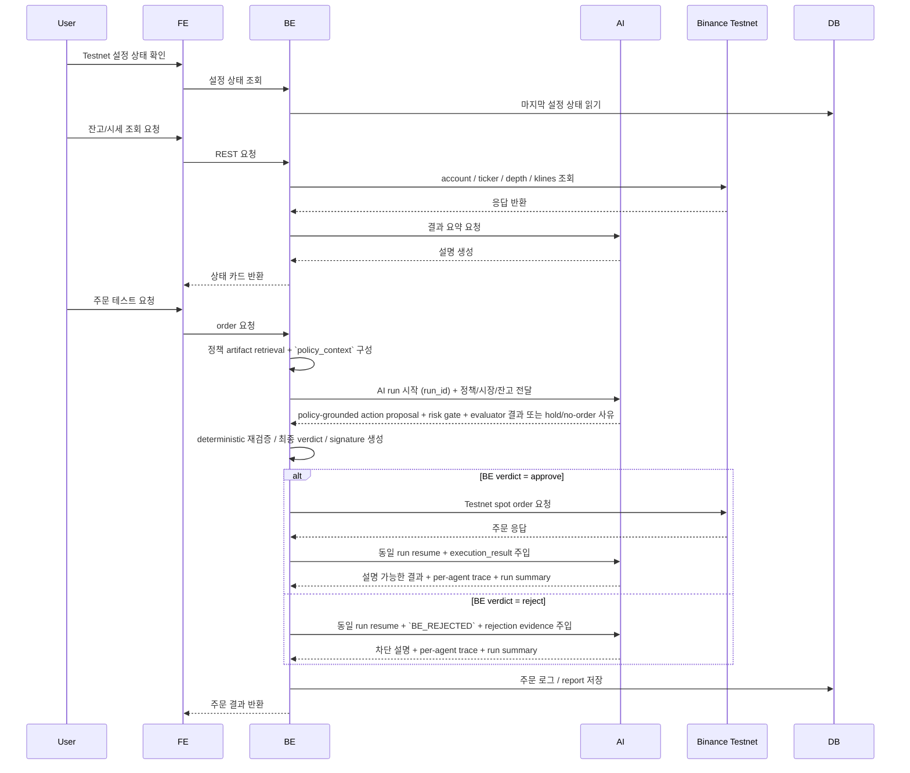
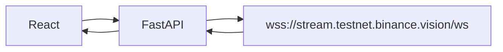
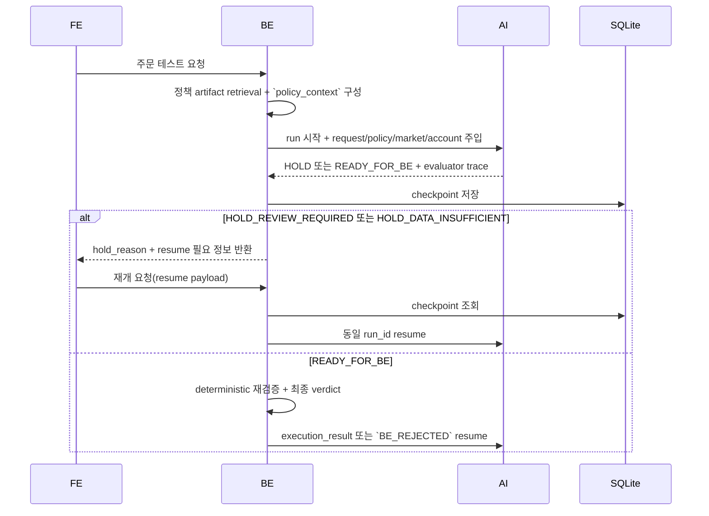

# Coin Agent 시스템 아키텍처

## 문서 목적

이 문서는 Coin Agent MVP의 전체 시스템 구조와 FE/BE/AI/DB/Binance Spot Testnet의 책임 경계를 설명한다. 이 프로젝트는 **Binance Spot Testnet 전용 가상 자금 현물 주문 테스트** 구조를 가진다.

## 관련 문서

- 요구사항: `SPEC.md`
- 데이터 계약: `DATA.md`
- FE 구현 기준: `FE.md`
- BE 구현 기준: `BE.md`
- AI 구현 기준: `AI.md`

## 1. 아키텍처 개요

Coin Agent는 다음 다섯 계층으로 구성된다.

1. React 기반 Frontend
2. FastAPI 기반 Backend API
3. LangGraph 기반 AI Orchestrator
4. SQLite 저장소
5. Binance Spot Testnet REST / WebSocket

핵심 원칙은 다음과 같다.

- FE는 입력과 시각화에 집중한다.
- BE는 Binance Spot Testnet REST/WebSocket 연동과 시그니처 처리, 주문 테스트 흐름을 담당한다.
- AI는 상태 기반 요청 해석, policy retrieval grounding, 리스크 게이트, evaluator/reflection, 결과 설명을 담당한다.
- 실거래는 다루지 않는다.
- API 호출은 모두 Testnet 환경에서만 수행한다.
- API Key/Secret은 서버 환경 변수에만 저장한다.
- AI의 `PASS` 판단은 실행 허가가 아니라 BE 재검증 전 단계 결과다.
- AI의 `PASS`와 evaluator 통과는 모두 action proposal 상태이며, deterministic 최종 verdict는 BE만 가진다.
- 주문 테스트 흐름은 하나의 AI run 상태를 resume하며 진행하고, 독립된 두 번의 프롬프트 호출 체인으로 구현하지 않는다.

## 2. 시스템 관계도

## 3. 상세 아키텍처

## 4. 책임 경계

| 계층 | 책임 | 하지 않는 일 |
|---|---|---|
| FE | 환경 변수 설정 상태 확인, 잔고/시세/주문 화면, 상태 시각화 | Binance 직접 호출, 시그니처 생성, API Key 원문 처리 |
| BE | REST/WebSocket 연동, 정책 artifact retrieval, 시그니처 생성, 주문 요청, 상태 조회, 취소, AI 통과 요청 재검증, deterministic 최종 verdict | 브라우저 렌더링, 실거래 전송 |
| AI | 요청 해석, 상태 전이 관리, policy-grounded action proposal 생성, 리스크 게이트, evaluator/reflection, 결과 설명 | Binance 직접 서명 요청, 실거래 전략 운용, BE 검증 우회 |
| DB | 환경 설정, 요청 로그, 주문 로그, 리포트 저장 | 시장 데이터의 영구 원본 저장 |
| Binance Spot Testnet | 가상 자금 기반 현물 API/WS 제공 | 내부 정책 판단 |

## 5. 핵심 흐름

### 5.1 설정 상태 확인 → 잔고 조회 → 시세 조회 → 주문 테스트 → 상태 확인 → 취소

### 5.2 WebSocket 시세 수신 흐름

### 5.3 AI run checkpoint / resume 흐름

### 5.4 Runtime contract 요약

- 모든 주문 테스트 run은 `run_id`로 식별한다.
- `policy_context`는 BE가 retrieval한 정책 artifact를 묶은 immutable grounding 컨텍스트다.
- `HOLD`는 lifecycle 상태이며, 실제 원인은 `hold_reason`으로 구분한다.
- `hold_reason`의 최소 집합은 `HOLD_REVIEW_REQUIRED`, `HOLD_DATA_INSUFFICIENT`다.
- `PASS`는 action proposal 상태이며, deterministic 최종 verdict가 아니다.
- evaluator/reflection은 proposal 품질을 점검하지만 실행 권한을 가지지 않는다.
- resume는 같은 `run_id`에 대해서만 허용한다.
- BE는 checkpoint 복원 후 immutable 필드를 유지한 채 resume payload만 병합한다.

### 5.5 Report cadence와 human review 경계

- 기본 보고 단위는 1 `run_id` 다.
- 아키텍처 수준의 보고 cadence는 request accepted, policy retrieval complete, policy complete, risk gate complete, evaluator complete, BE revalidation complete, final report ready 순서를 따른다.
- `HOLD`가 발생하면 cadence는 다음 단계로 진행하지 않고 같은 `run_id`의 resume 대기 상태로 멈춘다.
- 사람 검토 경계는 `HOLD_REVIEW_REQUIRED`에 한정해 열린다. 사람은 추가 승인, 명시적 거절, 보완 입력 제공을 할 수 있다.
- 사람 검토와 evaluator 통과가 있더라도 주문 제출 최종 권한은 BE deterministic verdict에만 있다.

## 6. 장애 및 예외 기본 원칙

- Testnet REST 실패 시 신규 주문 테스트를 중단한다.
- 잔고 조회 실패 시 주문 화면에서 주문 요청을 차단한다.
- 시그니처 생성 실패 시 즉시 에러를 반환한다.
- WebSocket 연결 실패 시 수동 조회 fallback을 사용한다.
- 실거래 URL 또는 잘못된 API Key 사용이 감지되면 즉시 실행을 차단한다.
- 정책 artifact retrieval 실패 시 action proposal 생성을 진행하지 않고 `HOLD` 또는 `FAILED`로 종료한다.
- evaluator가 근거 부족 또는 self-contradiction을 감지하면 `READY_FOR_BE`로 승격하지 않는다.
- AI가 `PASS`를 반환해도 BE 재검증 실패 시 `BE_REJECTED`로 종료한다.
- AI schema 검증 실패 시 BE는 주문 제출로 진행하지 않고 `FAILED` 또는 `HOLD` + `hold_reason=HOLD_DATA_INSUFFICIENT`로 종료한다.

## 7. run 저장소와 resume 경계

| 항목 | 기준 |
|---|---|
| 저장소 | SQLite checkpoint 레코드 |
| 식별자 | `run_id` |
| 복원 단위 | `AgentRunState` 전체 + latest trace + latest verification checks |
| immutable 필드 | `request_context`, `policy_context`, 최초 `normalized_order_intent`, 이전 단계 trace |
| resume 허용 필드 | 사용자 승인 결과, 재조회 시장 데이터, BE execution_result, 보완 입력 |
| 만료 기준 | 데모/로컬 환경 기준 TTL을 두되, 만료 시 `FAILED` 또는 재시작 안내 |
| 감사 보존 | 최종 상태 도달 후에도 `run_summary`와 `errors`를 로그에 남김 |

## 8. 신뢰 경계 및 보안 관점

- 브라우저는 Binance Testnet REST/WS를 직접 호출하지 않는다.
- API Key/Secret은 서버 측 환경 변수로만 보관한다.
- BE만 `timestamp`, `signature`, `X-MBX-APIKEY`를 처리한다.
- AI에는 API Key, Secret, signature 원문을 전달하지 않는다.
- BE만 deterministic rule verdict와 `BE_REJECTED` 생성 권한을 가진다.
- 실거래 host 문자열은 설정값과 문서에서 금지한다.
- FE는 API Key/Secret 원문을 입력받거나 저장하지 않는다.
- AI가 사용할 수 있는 도구는 Binance 직접 호출 도구가 아니라 BE 또는 내부 서비스가 제공하는 정규화 도구로 제한한다.

## 9. Human QA 기대치

- QA는 단일 happy path 확인으로 끝나지 않는다.
- 최소한 정책 허용, 정책상 승인 필요, 데이터 부족, BE 재검증 차단의 네 흐름을 사람 눈으로 검증해야 한다.
- QA는 policy retrieval 결과가 `policy_context`에 반영되는지, evaluator/reflection trace가 BE verdict와 구분되어 보이는지 확인해야 한다.
- QA 참가자는 `run_id`, `hold_reason`, `BE_REJECTED`, `verification_checks`가 문서와 화면에서 같은 의미로 보이는지 교차 확인해야 한다.

## 10. 확정 구현 기준

- REST Base URL은 `https://testnet.binance.vision/api`로 고정한다.
- WebSocket Streams URL은 `wss://stream.testnet.binance.vision/ws`로 고정한다.
- WebSocket API URL은 `wss://ws-api.testnet.binance.vision/ws-api/v3`로 고정한다.
- AI는 BE 내부 프로세스가 아니라 별도 HTTP 서비스로 두되, 로컬 동일 머신에서만 실행한다.
- 주문 예시는 Spot 현물 시장가/지정가만 다룬다.
- orderbook은 `depth` snapshot 기준으로 정의한다.
- `HOLD`와 `hold_reason`를 분리해 설계하고, FE/BE/AI가 동일 값 집합을 사용한다.
- resume는 checkpoint 복원 후 명시된 필드만 병합하는 방식으로 동작한다.