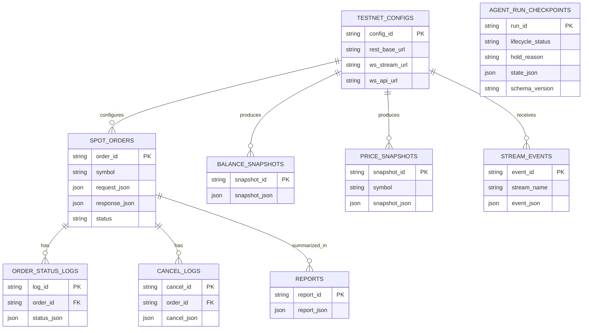

# Coin Agent 데이터 / API 계약 통합 문서

## 문서 목적

이 문서는 Binance Spot Testnet 전용 API 계약, 데이터 객체, 응답 예시, SQLite 저장 구조, ERD를 통합 관리한다.

## 관련 문서

- 요구사항: `SPEC.md`
- 시스템 구조: `ARCHITECTURE.md`
- 구현 기준: `FE.md`, `BE.md`, `AI.md`

## 1. 도메인 용어

| 용어 | 설명 |
|---|---|
| Testnet Account | Binance Spot Testnet 계정 |
| Symbol | `BTCUSDT`, `ETHUSDT`처럼 REST에서 사용하는 심볼 |
| Stream Name | `btcusdt@ticker`처럼 WebSocket에서 사용하는 소문자 stream 이름 |
| Depth Snapshot | `bids`, `asks` 배열 기반 orderbook 스냅샷 |
| BalanceSnapshot | 특정 시점의 계정 잔고 정보 |
| PriceSnapshot | 현재가/호가/캔들 요약 |
| SpotOrderRequest | Spot Testnet 현물 주문 요청 객체 |
| SpotOrderResponse | Spot Testnet 주문 응답 객체 |
| OrderStatusResponse | 주문 상태 조회 응답 |
| CancelOrderResponse | 주문 취소 응답 |
| ErrorResponse | 공통 오류 응답 |
| AgentRunState | AI 오케스트레이터 내부 상태 객체 |
| GateDecision | AI의 허용/차단/보류 판단 객체 |
| AgentDecisionTrace | Policy/Risk/Evaluator/Execution 공통 판단 근거와 최종 액션 객체 |
| RunDecisionTrace | 전체 run 기준 판단 요약 객체 |
| HoldDecision | `HOLD` 상태의 세부 원인 객체 |
| ResumeCommandPayload | 동일 run 재개를 위한 payload |
| CheckpointRecord | run 저장/복원 단위 객체 |
| NormalizedOrderIntent | Policy Node 구조화 출력 객체 |
| ReportPayload | 최종 사용자/저장용 리포트 객체 |
| VerificationResult | 공통 검증 결과 객체 |
| PolicyRetrievalPacket | Policy/Planning 단계의 정책 검색 결과 |
| EvaluationResult | evaluator/reflection 단계 점수와 retry 기록 |
| ReportCadenceEvent | 단계별 보고 시점 기록 |

## 2. 주요 데이터 객체

### 2.1 TestnetConfig

```json
{
  "rest_base_url": "https://testnet.binance.vision/api",
  "ws_stream_url": "wss://stream.testnet.binance.vision/ws",
  "ws_api_url": "wss://ws-api.testnet.binance.vision/ws-api/v3",
  "default_symbol": "BTCUSDT"
}
```

### 2.2 BalanceSnapshot

```json
{
  "canTrade": true,
  "balances": [
    {
      "asset": "USDT",
      "free": "10000.00000000",
      "locked": "0.00000000"
    }
  ],
  "updateTime": 1715000000000
}
```

### 2.3 PriceSnapshot

```json
{
  "symbol": "BTCUSDT",
  "price": "65000.12",
  "bestBidPrice": "64999.99",
  "bestBidQty": "0.12000000",
  "bestAskPrice": "65000.13",
  "bestAskQty": "0.45000000",
  "depth": {
    "lastUpdateId": 123456,
    "bids": [["64999.99", "0.12000000"]],
    "asks": [["65000.13", "0.45000000"]]
  },
  "latestKline": {
    "openTime": 1715000000000,
    "open": "64950.00",
    "high": "65100.00",
    "low": "64880.00",
    "close": "65000.12",
    "volume": "12.34000000"
  }
}
```

### 2.4 SpotOrderRequest

```json
{
  "symbol": "BTCUSDT",
  "side": "BUY",
  "type": "MARKET",
  "quoteOrderQty": "50"
}
```

### 2.5 Binance SpotOrderResponse (internal raw example)

```json
{
  "symbol": "BTCUSDT",
  "orderId": 123456789,
  "orderListId": -1,
  "clientOrderId": "demo-order-001",
  "transactTime": 1715000100000,
  "price": "0.00000000",
  "origQty": "0.00000000",
  "executedQty": "0.00076900",
  "cummulativeQuoteQty": "50.00000000",
  "status": "FILLED",
  "timeInForce": "GTC",
  "type": "MARKET",
  "side": "BUY"
}
```

### 2.6 Binance OrderStatusResponse (internal/raw example)

```json
{
  "symbol": "BTCUSDT",
  "orderId": 123456789,
  "clientOrderId": "demo-order-001",
  "price": "0.00000000",
  "origQty": "0.00000000",
  "executedQty": "0.00076900",
  "cummulativeQuoteQty": "50.00000000",
  "status": "FILLED",
  "type": "MARKET",
  "side": "BUY",
  "time": 1715000100000,
  "updateTime": 1715000101000
}
```

### 2.7 Binance CancelOrderResponse (internal/raw example)

```json
{
  "symbol": "BTCUSDT",
  "origClientOrderId": "demo-order-002",
  "orderId": 123456790,
  "status": "CANCELED",
  "clientOrderId": "cancel-order-002"
}
```

### 2.8 ErrorResponse

```json
{
  "error_code": "BINANCE_TESTNET_REQUEST_FAILED",
  "message": "Binance Spot Testnet 요청이 실패했습니다.",
  "detail": "timestamp 또는 signature를 확인하세요.",
  "request_id": "req_001",
  "timestamp": "2026-05-04T09:02:00+09:00"
}
```

### 2.9 AgentRunState

```json
{
  "run_id": "airun_001",
  "lifecycle_status": "RISK_REVIEW",
  "request_type": "PLACE_ORDER",
  "final_action": "HOLD"
}
```

### 2.10 OrderRunResponse (public contract)

```json
{
  "runId": "run_abc123",
  "lifecycleStatus": "NO_ORDER",
  "holdReason": null,
  "orderId": null,
  "symbol": null,
  "status": null,
  "type": null,
  "side": null,
  "reasonCodes": ["SYMBOL_NOT_ALLOWED"]
}
```

- `POST /api/v1/testnet/orders` 와 `POST /api/v1/testnet/orders/resume` 의 public 응답은 위 run 중심 계약을 사용한다.
- Binance 원본 order payload 전체는 내부 저장/원본 로그 용도이며, public contract가 아니다.

### 2.10 GateDecision

```json
{
  "decision": "REJECT",
  "reason_codes": ["INSUFFICIENT_BALANCE"],
  "stage": "risk_gate"
}
```

### 2.11 VerificationResult

```json
{
  "name": "min_notional_check",
  "result": "pass",
  "evidence_refs": ["exchange_rules.MIN_NOTIONAL", "normalized_order_intent.quoteOrderQty"]
}
```

### 2.12 AgentDecisionTrace

```json
{
  "reason_codes": ["LIMIT_PRICE_REQUIRED"],
  "evidence_refs": ["normalized_order_intent.type"],
  "final_action": "NO_ORDER",
  "notes": "지정가 주문 필수 필드 누락"
}
```

### 2.13 RunDecisionTrace

```json
{
  "run_id": "airun_001",
  "final_action": "BE_REJECTED",
  "be_override": true,
  "gate_decision": "PASS",
  "notes": "AI gate 통과 후 BE 재검증에서 차단"
}
```

### 2.14 Internal AI Report Payload

```json
{
  "run_id": "airun_001",
  "gate_decision": "PASS",
  "final_action": "REPORT_READY",
  "decision_trace": {
    "policy": {
      "reason_codes": ["ORDER_INTENT_NORMALIZED"],
      "final_action": "READY_FOR_BE"
    },
    "risk": {
      "reason_codes": ["ALL_CHECKS_PASSED"],
      "final_action": "READY_FOR_BE"
    },
    "evaluator": {
      "reason_codes": ["EVIDENCE_SUFFICIENT"],
      "final_action": "READY_FOR_BE"
    },
    "execution": {
      "reason_codes": ["ORDER_RESPONSE_VERIFIED"],
      "final_action": "REPORT_READY"
    },
    "run_summary": {
      "final_action": "REPORT_READY",
      "be_override": false
    }
  },
  "user_summary": "주문 테스트 요청이 정책과 거래소 규칙을 충족해 Backend 검증 후 제출되었습니다."
}
```

위 예시에서 `decision_trace.policy`, `decision_trace.risk`, `decision_trace.evaluator`의 `final_action=READY_FOR_BE`는 최종 실행 결과가 아니라 **BE deterministic revalidation 직전의 proposal handoff 상태**를 뜻한다.

### 2.15 HoldDecision

```json
{
  "decision": "HOLD",
  "hold_reason": "HOLD_DATA_INSUFFICIENT",
  "reason_codes": ["STALE_MARKET_SNAPSHOT"],
  "resume_required": true
}
```

### 2.16 ResumeCommandPayload

```json
{
  "run_id": "airun_001",
  "resume_reason": "USER_APPROVED_ORDER",
  "patch_fields": {
    "approval": {
      "approved": true,
      "approved_at": "2026-05-06T11:00:00+09:00"
    }
  }
}
```

### 2.17 CheckpointRecord

```json
{
  "run_id": "airun_001",
  "lifecycle_status": "HOLD",
  "hold_reason": "HOLD_REVIEW_REQUIRED",
  "schema_version": "v1",
  "expires_at": "2026-05-06T12:00:00+09:00",
  "state": {
    "request_context": {"request_id": "req_001"},
    "decision_trace": {"risk": {"final_action": "HOLD"}}
  }
}
```

### 2.18 Structured output 모델 이름

| 모델 이름 | 용도 | 최소 필수 필드 |
|---|---|---|
| `NormalizedOrderIntent` | Policy Node 출력 | `symbol`, `side`, `type` |
| `AgentDecisionTrace` | Policy/Risk/Evaluator/Execution trace | `reason_codes`, `final_action` |
| `RiskAssessment` | Risk 해석 결과 | `reason_codes`, `verification_checks` |
| `GateDecision` | gate 결과 | `decision`, `reason_codes` |
| `HoldDecision` | hold 세부 원인 | `decision`, `hold_reason`, `resume_required` |
| `VerificationResult` | 실행 결과를 포함한 공통 검증 결과 | `name`, `result`, `evidence_refs` |
| `ReportPayload` | AI 내부 리포트 payload | `run_id`, `gate_decision`, `final_action`, `decision_trace`, `user_summary` |
| `PublishedRunReport` | BE가 FE에 공개하는 최종 리포트 | `lifecycleStatus`, `holdReason`, `reasonCodes`, `userSummary`, `decisionTrace`, `order` |
| `RunDecisionTrace` | run 요약 trace stage | `reason_codes`, `evidence_refs`, `final_action` |

### 2.19 PolicyRetrievalPacket

```json
{
  "request_id": "req_001",
  "policy_refs": ["policy.symbol_allowlist", "policy.max_quote_limit"],
  "retrieved_at": "2026-05-06T10:58:00+09:00",
  "applied_rules": {
    "allowed_symbols": ["BTCUSDT", "ETHUSDT"],
    "max_quote_order_qty": "50"
  }
}
```

### 2.20 EvaluationResult

```json
{
  "stage": "risk_evaluator",
  "target": "gate_decision",
  "score": 92,
  "retry_count": 0,
  "passed": true
}
```

### 2.21 ReportCadenceEvent

```json
{
  "run_id": "airun_001",
  "event_type": "BE_REVALIDATION_COMPLETED",
  "lifecycle_status": "BE_REJECTED",
  "created_at": "2026-05-06T11:01:00+09:00"
}
```

## 3. REST API 계약

이 문서의 `/api/v1/testnet/*` 응답 예시는 BE가 정규화한 포맷이다. Binance 원본 전체 payload는 내부 로그/저장소에 보관할 수 있지만, FE와 테스트는 아래 응답 구조를 기준으로 구현한다.

또한 AI 관련 응답은 단순 결과 문자열이 아니라, 정책 검색 근거, 평가 기록, 단계별 보고 이벤트를 함께 남길 수 있어야 한다. LLM이 만든 action proposal은 저장 가능하지만, 실행 승인 레코드는 deterministic 검증 결과와 분리해 기록한다.

### 3.1 잔고 조회

`GET /api/v1/testnet/account`

응답 예시:

```json
{
  "balances": [
    {
      "asset": "USDT",
      "free": "10000.00000000",
      "locked": "0.00000000"
    }
  ]
}
```

### 3.2 현재가 조회

`GET /api/v1/testnet/ticker/price?symbol=BTCUSDT`

응답 예시:

```json
{
  "symbol": "BTCUSDT",
  "price": "65000.12"
}
```

### 3.3 호가 / orderbook 조회

`GET /api/v1/testnet/ticker/book?symbol=BTCUSDT`

응답 예시:

```json
{
  "symbol": "BTCUSDT",
  "bidPrice": "64999.99",
  "bidQty": "0.12000000",
  "askPrice": "65000.13",
  "askQty": "0.45000000",
  "depth": {
    "lastUpdateId": 123456,
    "bids": [["64999.99", "0.12000000"]],
    "asks": [["65000.13", "0.45000000"]]
  }
}
```

### 3.4 캔들 조회

`GET /api/v1/testnet/klines?symbol=BTCUSDT&interval=1m&limit=5`

응답 예시:

```json
{
  "symbol": "BTCUSDT",
  "interval": "1m",
  "items": [
    {
      "openTime": 1715000000000,
      "open": "64950.00",
      "high": "65100.00",
      "low": "64880.00",
      "close": "65000.12",
      "volume": "12.34000000"
    }
  ]
}
```

### 3.5 Spot 매수/매도 주문

`POST /api/v1/testnet/orders`

요청 예시 1: 시장가 매수

```json
{
  "symbol": "BTCUSDT",
  "side": "BUY",
  "type": "MARKET",
  "quoteOrderQty": "50"
}
```

요청 예시 2: 시장가 매도

```json
{
  "symbol": "BTCUSDT",
  "side": "SELL",
  "type": "MARKET",
  "quantity": "0.001"
}
```

요청 예시 3: 지정가 주문

```json
{
  "symbol": "BTCUSDT",
  "side": "BUY",
  "type": "LIMIT",
  "timeInForce": "GTC",
  "price": "64000",
  "quantity": "0.001"
}
```

공개 응답 예시:

```json
{
  "runId": "run_abc123",
  "lifecycleStatus": "REPORT_READY",
  "holdReason": null,
  "orderId": 123456789,
  "symbol": "BTCUSDT",
  "status": "NEW",
  "type": "LIMIT",
  "side": "BUY",
  "reasonCodes": []
}
```

- `POST /api/v1/testnet/orders` 의 public 응답은 Binance raw order payload가 아니라 run 중심 `OrderRunResponse` 다.
- `HOLD`, `NO_ORDER`, `BE_REJECTED` 도 같은 엔드포인트에서 `lifecycleStatus` 와 `reasonCodes` 중심으로 반환될 수 있다.

### 3.6 주문 상태 조회

`GET /api/v1/testnet/orders/status?symbol=BTCUSDT&orderId=123456789`

또는

`GET /api/v1/testnet/orders/status?symbol=BTCUSDT&origClientOrderId=demo-order-001`

응답 예시:

```json
{
  "orderId": 123456789,
  "symbol": "BTCUSDT",
  "status": "PARTIALLY_FILLED",
  "executedQty": "0.00050000"
}
```

### 3.7 주문 취소

`DELETE /api/v1/testnet/orders`

요청 예시:

```json
{
  "symbol": "BTCUSDT",
  "orderId": 123456789
}
```

또는

```json
{
  "symbol": "BTCUSDT",
  "origClientOrderId": "demo-order-001"
}
```

응답 예시:

```json
{
  "orderId": 123456789,
  "symbol": "BTCUSDT",
  "status": "CANCELED"
}
```

## 4. Binance Spot Testnet 주문 파라미터 요약

| 파라미터 | 설명 |
|---|---|
| `symbol` | 예: `BTCUSDT` |
| `side` | `BUY`, `SELL` |
| `type` | `MARKET`, `LIMIT` |
| `quantity` | 수량 기준 주문 시 사용 |
| `quoteOrderQty` | quote 자산 금액 기준 시장가 매수 시 사용 |
| `price` | 지정가 주문 가격 |
| `timeInForce` | 예: `GTC` |
| `timestamp` | ms 단위 현재 시각 |
| `recvWindow` | 선택, 기본 5000ms |
| `signature` | signed endpoint 필수 |

## 5. 주문 파라미터 검증 기준

- `exchangeInfo` 기준 `PRICE_FILTER`, `LOT_SIZE`, `MIN_NOTIONAL`을 사용한다.
- 시장가 매수는 `quoteOrderQty`, 시장가 매도는 `quantity`를 기본 예시로 사용한다.
- 지정가 주문은 `price`, `quantity`, `timeInForce`가 모두 필요하다.

## 6. 상태/열거값 요약

- `side`: `BUY`, `SELL`
- `type`: `MARKET`, `LIMIT`
- `order status`: `NEW`, `PARTIALLY_FILLED`, `FILLED`, `CANCELED`, `REJECTED`, `EXPIRED`
- `lifecycle_status`: `RECEIVED`, `NORMALIZING`, `NEEDS_INPUT`, `RISK_REVIEW`, `HOLD`, `READY_FOR_BE`, `BE_REJECTED`, `EXECUTING`, `RESULT_VERIFYING`, `REPORT_READY`, `NO_ORDER`, `FAILED`
- `hold_reason`: `HOLD_REVIEW_REQUIRED`, `HOLD_DATA_INSUFFICIENT`
- `report cadence`: request accepted, policy retrieval complete, policy complete, risk gate complete, evaluator complete, BE revalidation complete, final report ready

### 6.1 상태 필드 해석 규칙

- `HOLD`는 lifecycle 상태이며, 세부 의미는 `hold_reason`로 해석한다.
- `BE_REJECTED`는 BE 재검증에서만 생성된다.
- schema mismatch는 복구 가능 여부에 따라 `HOLD` + `hold_reason=HOLD_DATA_INSUFFICIENT` 또는 `FAILED`로 처리한다.
- `HOLD_REVIEW_REQUIRED`, `HOLD_DATA_INSUFFICIENT`는 lifecycle 상태가 아니라 `hold_reason` 값이다.

## 7. DB 테이블 초안

| 테이블 | 주요 컬럼 |
|---|---|
| `testnet_configs` | `config_id`, `rest_base_url`, `ws_stream_url`, `ws_api_url`, `created_at` |
| `balance_snapshots` | `snapshot_id`, `snapshot_json`, `created_at` |
| `price_snapshots` | `snapshot_id`, `symbol`, `snapshot_json`, `created_at` |
| `spot_orders` | `order_id`, `symbol`, `request_json`, `response_json`, `status`, `created_at` |
| `order_status_logs` | `log_id`, `order_id`, `status_json`, `created_at` |
| `cancel_logs` | `cancel_id`, `order_id`, `cancel_json`, `created_at` |
| `stream_events` | `event_id`, `stream_name`, `event_json`, `created_at` |
| `reports` | `report_id`, `report_json`, `created_at` |
| `agent_run_checkpoints` | `run_id`, `lifecycle_status`, `hold_reason`, `state_json`, `schema_version`, `expires_at`, `created_at` |

`reports.report_json`에는 사용자용 요약뿐 아니라 `decision_trace.policy`, `decision_trace.risk`, `decision_trace.execution`, `decision_trace.run_summary` 같은 구조화 trace를 함께 저장할 수 있다. 다만 API Key, Secret, signature, production host 문자열은 저장 대상이 아니다.

### 7.1 checkpoint 저장 규칙

- checkpoint는 `run_id` 기준 1 run 1 latest snapshot을 유지한다.
- `request_context`, `policy_context`, 과거 trace는 overwrite하지 않는다.
- `verification_checks`, `errors`는 append된 누적 상태를 저장한다.
- `schema_version`을 함께 저장해 FE/BE/AI가 같은 계약 버전을 사용하도록 한다.
- TTL 만료 후 재개 요청이 오면 `FAILED` 또는 run 재시작 안내로 처리한다.

## 8. Mermaid ERD



## 9. 실수 방지 주의사항

- `api.binance.com` 관련 문자열을 저장하지 않는다.
- `BINANCE_TESTNET_*`가 아닌 변수명을 사용하지 않는다.
- WebSocket stream symbol은 소문자여야 한다.
- 많은 Binance 숫자 응답 값은 문자열이라는 점을 유지한다.
- AI 내부 trace에는 비밀키, signature, raw auth header를 저장하지 않는다.
- checkpoint와 resume payload에는 Binance raw auth 정보를 저장하지 않는다.

## 10. 확정 구현 기준

- REST 예시는 모두 Testnet 기준만 사용한다.
- WebSocket 예시는 stream endpoint 기준만 사용한다.
- 주문 응답 예시는 Spot 현물 주문 결과만 사용한다.
- 내부 AI 객체는 공개 REST 계약과 분리되며, 판단 trace와 gate 결과를 표현하는 용도로만 사용한다.
- `BE_REJECTED`는 BE 재검증 단계에서만 생성되는 상태다.
- `HOLD`와 `hold_reason`는 분리된 필드로 유지한다.
- AI node output은 이 문서의 이름 있는 모델 이름을 기준으로 검증한다.
