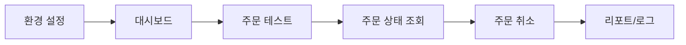

# Coin Agent Frontend 개발 명세

## 문서 목적

이 문서는 React 기반 Frontend의 페이지, 컴포넌트, UI 상태, Binance Spot Testnet 전용 시각화 요구사항을 정의한다.

## 관련 문서

- 요구사항: `SPEC.md`
- 아키텍처: `ARCHITECTURE.md`
- API 계약: `DATA.md`
- AI 계약: `AI.md`
- 테스트 기준: `TEST_AND_DEMO.md`

## 1. FE 역할

FE는 사용자가 Binance Spot Testnet 설정, 잔고 조회, 시세 조회, 현물 주문 테스트, 주문 상태 조회, 주문 취소, WebSocket 시세 확인을 쉽게 수행할 수 있도록 돕는다. 모든 외부 API 호출은 반드시 BE를 통해 수행한다.

FE는 Agent가 스스로 판단한 것처럼 보이더라도, 실행 결정권이 AI에 있지 않다는 점을 항상 드러내야 한다. 따라서 화면은 “AI 제안”과 “BE 최종 판정”을 같은 것으로 합쳐 보여주지 않는다.

## 2. 페이지 목록

| 페이지 | 경로 예시 | 목적 |
|---|---|---|
| 환경 설정 | `/settings` | Testnet 환경 변수 설정 상태 확인, base URL 표시 |
| 대시보드 | `/dashboard` | 잔고, 현재가, orderbook, 캔들, stream 상태 표시 |
| 주문 테스트 | `/orders` | 현물 매수/매도 주문 생성, 주문 상태 조회, 취소 |
| 리포트/로그 | `/reports` | 주문 결과, 에러, 테스트 기록 확인 |

## 3. 화면 흐름

## 4. 주요 컴포넌트

| 컴포넌트 | 목적 | 표시 내용 |
|---|---|---|
| `EnvironmentCard` | Testnet 환경 상태 확인 | REST/WS base URL, 서버 환경 변수 설정 상태 |
| `BalanceCard` | 계좌 잔고 확인 | `asset`, `free`, `locked` |
| `PriceCard` | 현재가 표시 | `symbol`, `price` |
| `OrderBookCard` | orderbook 표시 | bids / asks depth snapshot |
| `KlineChart` | 캔들 시각화 | OHLCV |
| `OrderForm` | Spot 주문 테스트 | `symbol`, `side`, `type`, `quantity`, `quoteOrderQty`, `price` |
| `OrderStatusPanel` | 주문 상태 조회 | `orderId` 또는 `origClientOrderId`, `status`, `executedQty` |
| `CancelOrderPanel` | 주문 취소 | `symbol`, `orderId` 또는 `origClientOrderId` |
| `StreamStatusCard` | WebSocket 연결 상태 | stream name, latest event |

## 5. 화면별 사용자 흐름

### 5.1 환경 설정 화면

1. 사용자가 Testnet Key의 서버 설정 상태를 확인한다.
2. 시스템은 현재 Testnet base URL을 읽기 전용으로 보여준다.
3. FE는 API Key 원문을 입력받거나 표시하지 않는다.
4. 실거래 URL이 아님을 경고 배너로 항상 노출한다.

### 5.2 대시보드 화면

1. 사용자가 `BTCUSDT` 또는 `ETHUSDT`를 선택한다.
2. 시스템은 잔고, 현재가, orderbook depth, 캔들 요약을 표시한다.
3. WebSocket 연결 상태를 별도 카드로 보여준다.

### 5.3 주문 테스트 화면

1. 사용자가 주문 타입을 선택한다.
2. 시장가 매수 시 `quoteOrderQty`, 시장가 매도 시 `quantity`를 입력한다.
3. 지정가 주문 시 `price`, `quantity`, `timeInForce`를 입력한다.
4. 주문 결과는 즉시 로그 영역에 표시한다.

### 5.4 리포트/로그 화면

1. 기본 구현은 `run_id` 기준 단일 리포트 조회다.
2. FE는 `GET /api/v1/testnet/orders/report?runId=...` 로 published report 를 조회한다.
3. cadence/history 전용 API가 없으면 해당 영역은 placeholder로 표시할 수 있다.
4. 실패 원인과 핵심 `reason_codes`를 함께 표시한다.

## 6. UI 상태 정의

| 상태 | 정의 | UI 처리 원칙 |
|---|---|---|
| 로딩 | BE 응답 대기 중 | 스켈레톤 또는 spinner |
| 빈 상태 | 아직 조회/주문 이력 없음 | 시작 가이드 표시 |
| 성공 | 응답 정상 수신 | 카드/차트/표 표시 |
| 부분 오류 | 일부 API 실패 | 오류 배너 + 마지막 정상 데이터 |
| 전체 오류 | 핵심 API 실패 | 실거래 금지 경고와 함께 재시도 안내 |

### 6.1 Agent 상태 표시 계약

| 상태 | 필수 표시 항목 | 사용자 액션 |
|---|---|---|
| `NO_ORDER` | 차단 사유, `reason_codes` | 입력 수정 |
| `HOLD` + `hold_reason=HOLD_REVIEW_REQUIRED` | 검토 필요 사유, 승인 필요 배지 | 승인/거절 또는 취소 |
| `HOLD` + `hold_reason=HOLD_DATA_INSUFFICIENT` | 누락/오래된 데이터 설명 | 재조회/재입력 후 resume |
| `BE_REJECTED` | AI 통과 후 BE 차단 설명, 필요 시 최종 보고 전 단계 표시 | 상세 사유 보기 |
| `FAILED` | 기술 실패 원인, 재시도 가능 여부 | 재시도 또는 run 종료 |

### 6.2 Agent 단계 표시 원칙

- FE는 가능하면 `decision_trace.policy`, `decision_trace.risk`, `decision_trace.evaluator`, `decision_trace.execution`, `decision_trace.run_summary`를 단계 카드로 구분한다.
- Policy/Planning 단계에는 policy retrieval 근거가 요약되어야 한다.
- Risk 단계에는 핵심 `reason_codes`와 trace 근거가 보여야 한다.
- `PASS` 배지는 pre-BE handoff 상태를 뜻할 수 있으므로, 단독 완료 의미로 쓰지 않고 “BE 재검증 대기” 설명과 함께 표시한다.

## 7. UI/UX 원칙

- 항상 “Binance Spot Testnet” 문구를 상단에 표시한다.
- 실거래가 아님을 배너로 명확히 표시한다.
- 주문 버튼은 필수 파라미터가 모두 채워져야 활성화한다.
- stream 이름은 소문자, REST 심볼은 대문자로 설명한다.
- 수익 보장이나 공격적 투자 표현은 사용하지 않는다.
- `HOLD_REVIEW_REQUIRED`와 `HOLD_DATA_INSUFFICIENT`는 동일한 보류 화면이 아니라 서로 다른 CTA를 제공해야 한다.

## 8. 디자인 시스템 요약

- 위험/실수 방지 배너는 빨간색 또는 주황색 경고 톤 사용
- 정상 상태 카드는 중립/청색 계열 사용
- 주문 결과는 상태별 배지 사용: `NEW`, `FILLED`, `CANCELED`, `REJECTED`
- 숫자는 문자열 응답을 화면에서 정규화해 표시하되, 원본 값도 확인 가능하도록 한다.

## 9. FE의 resume / trace 표시 계약

- FE는 `run_id`를 숨기지 않고 디버그/로그 영역에서 확인 가능하게 한다.
- `HOLD_REVIEW_REQUIRED` 응답에는 승인/거절 액션을 노출한다.
- `HOLD_DATA_INSUFFICIENT` 응답에는 재조회 또는 보완 입력 액션을 노출한다.
- `decision_trace`의 핵심 `reason_codes`와 단계별 근거를 리포트/로그 화면에 표시한다.
- schema mismatch나 `FAILED` 상태는 일반 주문 차단과 구분된 오류 스타일을 사용한다.

### 9.1 리포트 단위와 cadence 표시

- 기본 구현의 리포트 조회 단위는 `run_id`다.
- cadence/history 전용 API가 없으면 상세 보기에서 placeholder를 보여줄 수 있다.
- canonical cadence 자체는 request accepted, policy retrieval complete, policy complete, risk gate complete, evaluator complete, BE revalidation complete, final report ready 순서를 기준으로 유지한다.
- FE 기본 화면은 이 canonical cadence 중 사용자에게 중요한 subset만 간략히 보여줄 수 있다.
- `HOLD` 이후 resume가 발생하면 같은 `run_id` 안에서 이어 붙인 표현을 사용할 수 있다.

## 10. FE에서 호출하는 API 요약

| API | 목적 |
|---|---|
| `GET /api/v1/testnet/account` | 잔고 조회 |
| `GET /api/v1/testnet/ticker/price` | 현재가 조회 |
| `GET /api/v1/testnet/ticker/book` | orderbook depth 조회 |
| `GET /api/v1/testnet/klines` | 캔들 조회 |
| `POST /api/v1/testnet/orders` | Spot 주문 테스트 |
| `GET /api/v1/testnet/orders/report` | `run_id` 기준 최종 리포트 조회 |
| `GET /api/v1/testnet/orders/status` | 주문 상태 조회 |
| `DELETE /api/v1/testnet/orders` | 주문 취소 |
| `GET /api/v1/testnet/stream/status` | WebSocket 연결 상태 확인 |

FE는 동일 `run_id`를 포함한 재개 요청을 보내야 한다.

## 11. 확정 구현 기준

- 기본 심볼 예시는 `BTCUSDT`와 `ETHUSDT`를 사용한다.
- 시세 자동 갱신은 기본적으로 수동 조회 버튼 기반으로 처리한다.
- 실시간 데이터는 보조 기능으로 WebSocket 카드에서만 표시한다.
- FE는 Binance API Key/Secret 원문을 입력받거나 재표시하지 않는다.
- FE는 `HOLD_REVIEW_REQUIRED`와 `HOLD_DATA_INSUFFICIENT`를 구분 표시한다.
- FE는 `run_id`, `hold_reason`, 핵심 `reason_codes`를 결과/로그 영역에서 확인 가능하게 한다.
- FE는 휴먼 QA가 각 단계의 권한 경계를 확인할 수 있도록 `BE_REJECTED`와 `FAILED`를 별도 의미로 보여준다.
