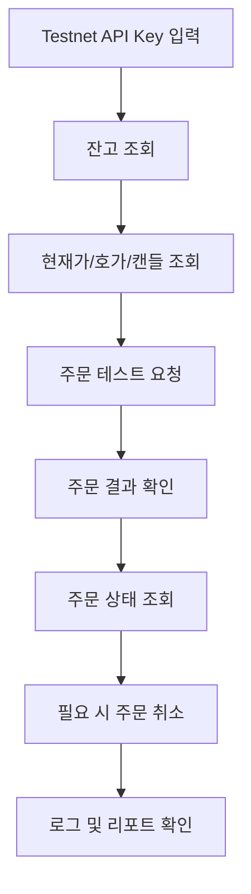

# Coin Agent 프로젝트 기획서

> 이 문서는 Coin Agent의 상위 기획 근거 문서다. 본 프로젝트는 Binance Spot Testnet 전용 가상 자금 현물 주문 테스트를 수행하는 개인용 Agent를 목표로 한다.

## 문서 목적

이 문서는 Coin Agent의 기획 배경, 문제 정의, 사용자 가치, MVP 수준의 실행 방향을 정리한다. 상세 요구사항, 구조, 데이터 계약, 역할별 구현 기준은 각 하위 문서를 참조한다.

## 관련 문서

- 문서 진입점: `README.md`
- 제품/기능 요구사항: `SPEC.md`
- 시스템 구조: `ARCHITECTURE.md`
- 데이터 계약: `DATA.md`
- 역할별 구현 기준: `FE.md`, `BE.md`, `AI.md`
- 테스트 / 데모 기준: `TEST_AND_DEMO.md`

## 목차

- [0. 기본 정보](#0-기본-정보)
- [1. 문제 정의 및 프로젝트 개요](#1-문제-정의-및-프로젝트-개요)
- [2. 사용자 및 통합 Agent 설계](#2-사용자-및-통합-agent-설계)
- [3. 핵심 기능 및 사용자 흐름](#3-핵심-기능-및-사용자-흐름)
- [4. 기술 구현 설계](#4-기술-구현-설계)
- [5. 성과 평가 및 실행 계획](#5-성과-평가-및-실행-계획)

---

## 0. 기본 정보

| 항목 | 내용 |
|---|---|
| 프로젝트명 | Coin Agent |
| 팀명 | 53조 |
| 참여자 | 박철민, 백승우, 백준현, 신진범, 장보형 |
| 작성일 | 2026-05-04 |
| 버전 | v2.0 |
| 거래소 범위 | Binance Spot Testnet 전용 |

---

## 1. 문제 정의 및 프로젝트 개요

### 1.1 프로젝트 한 줄 정의

```text
우리는 24시간 움직이는 가상자산 시장을 계속 지켜보기 어려운 개인 사용자를 위해, Binance Spot Testnet 환경에서 가상 자금으로 현물 주문과 체결 흐름을 안전하게 테스트하고 설명 가능한 결과를 제공하는 개인용 투자 보조 Agent를 개발한다.
```

### 1.2 서비스 한 줄 정의

```text
Coin Agent는 Binance Spot Testnet의 시세, 호가, 캔들, 잔고, 주문 상태를 조회하고, 사용자가 정의한 정책과 리스크 기준 안에서만 가상 자금 현물 주문 테스트를 수행하며, 결과를 자연어와 로그로 설명하는 투자 보조 서비스이다.
```

### 1.3 서비스 선정 배경

```text
자동화된 투자 보조 시스템을 만들 때 가장 먼저 필요한 것은 실거래가 아니라 안전한 테스트 환경이다. 사용자는 실제 자금을 잃지 않으면서도 시세 조회, 주문 요청, 체결 상태 확인, 주문 취소, 리포트 확인까지 전체 흐름을 검증하고 싶어한다.

Binance Spot Testnet은 가상 자금 기반 현물 주문 테스트를 제공하므로, 개인용 Agent를 빠르게 검증하기에 적합하다. 따라서 본 프로젝트는 실거래 기능을 배제하고, 오직 Spot Testnet 기반의 모의 주문과 체결 확인 흐름만 다루도록 범위를 제한한다.
```

### 1.4 해결하려는 문제

| 구분 | 작성 내용 |
|---|---|
| 현재 상황 | 개인 사용자는 거래 자동화 로직을 검증하고 싶지만, 실거래 환경은 위험 부담이 크다. |
| 사용자가 겪는 문제 | API 연동, 시세 수신, 주문 생성, 상태 확인 흐름을 실제 자금 없이 반복 테스트하기 어렵다. |
| 문제가 발생하는 이유 | 실거래 계정과 실거래 API를 바로 연결하면 테스트 실패 비용이 크고, 자동화 로직 검증이 조심스러워진다. |
| 해결이 필요한 이유 | Spot Testnet 기반의 가상 자금 주문 테스트 환경을 통해, 개인 사용자는 안전하게 Agent 로직과 주문 흐름을 검증할 수 있어야 한다. |

### 1.5 대상 사용자

| 항목 | 작성 내용 |
|---|---|
| 주요 사용자 | 개인용 자동화/보조 Agent를 직접 실험하려는 1인 사용자 |
| 사용자가 처한 상황 | 실거래 전 단계에서 Spot Testnet으로 주문·체결·취소 흐름을 검증하고 싶다. |
| 사용자의 목표 | 가상 자금으로 현물 주문 흐름을 안전하게 테스트하고, 각 단계의 결과와 실패 원인을 이해하는 것 |
| 사용자의 어려움 | 인증, 시그니처, 심볼 규칙, 주문 파라미터, 체결 상태를 한 번에 이해하기 어렵다. |

### 1.6 핵심 가치

```text
Coin Agent의 핵심 가치는 “실거래 없이도 전체 현물 주문 테스트 흐름을 이해하고 검증할 수 있게 하는 것”이다.
이 서비스는 Binance Spot Testnet만 사용하며, 시세 조회, 잔고 확인, 현물 매수/매도, 주문 상태 조회, 주문 취소, WebSocket 시세 수신까지를 안전하게 실험할 수 있도록 돕는다.
```

---

## 2. 사용자 및 통합 Agent 설계

### 2.1 타깃 사용자 페르소나

| 항목 | 작성 내용 |
|---|---|
| 이름/유형 | 김현우 / 개인용 모의투자 Agent 실험 사용자 |
| 연령대 | 20대 후반 ~ 30대 후반 |
| 직업/역할 | 개발자 또는 개발 친화적 개인 사용자 |
| 사용 환경 | 로컬 PC에서 React 화면과 FastAPI 서버를 함께 실행하며 Spot Testnet으로 테스트한다. |
| 주요 니즈 | 실거래 없는 안전한 주문 테스트, 시그니처/인증 이해, 체결 상태 확인, 실패 원인 파악 |
| 주요 불편함 | 실제 거래소 API 문서가 방대하고, 어떤 엔드포인트를 어떤 순서로 써야 하는지 빠르게 파악하기 어렵다. |

### 2.2 통합 Agent 시스템 개념

| 구분 | 작성 내용 |
|---|---|
| 시스템 구조 | 하나의 LangGraph 기반 통합 오케스트레이터 안에 3개의 AI 역할 Agent를 포함하는 구조 |
| 통합 목적 | 주문 테스트와 설명을 하나의 일관된 흐름으로 제공해 실험 속도를 높임 |
| 사용자에게 보이는 형태 | 테스트넷 키 설정, 시세/잔고 조회, 주문 테스트, 상태 확인, 로그/리포트 확인을 제공하는 하나의 서비스 |
| 내부 역할 분해 | Policy/Planning Agent, Market/Risk Agent, Execution/Report Agent |
| 핵심 원칙 | Testnet 전용, 가상 자금 전용, 실거래 금지, 리스크 게이트 우선 |

이 구조를 Agent라고 부르는 이유는, LLM 호출이 길게 이어지는 선형 Prompt Chaining이 아니라 각 역할이 **자기 상태, 자기 산출물, 자기 실패 기본값**을 가진 채 같은 `run_id` 안에서 이어지기 때문이다. Policy/Planning은 정책과 요청을 grounding하고, Market/Risk는 그 결과를 다시 평가하며, Execution/Report는 실행 또는 차단 결과를 독립적으로 해석한다. 다만 실행 권한은 AI에 있지 않고, 후보 경로 제안까지만 AI가 맡으며 최종 제출 여부는 deterministic rule 기반 BE가 확정한다.

### 2.3 통합 Agent의 역할

| 구분 | 작성 내용 |
|---|---|
| Agent가 수행하는 일 | 사용자의 테스트 정책을 구조화하고, Binance Spot Testnet 시세/잔고/주문 상태를 조회하며, 현물 주문 테스트 결과를 설명한다. |
| Agent가 도와주는 범위 | 시세 조회, 호가 조회, 캔들 조회, 잔고 조회, 매수/매도 주문 테스트, 주문 상태 조회, 주문 취소, 리포트 생성 |
| Agent가 하지 않는 일 | 실거래 주문, 선물, 마진, 출금, 레버리지, 수익 보장 |
| 최종 산출물 | 상태 카드, 주문 결과 카드, 잔고 요약, 주문 로그, 테스트 리포트 |

### 2.4 Agent의 자율성 범위

| 단계 | Agent 수행 가능 여부 | 설명 |
|---|---:|---|
| 사용자 입력 해석 | 가능 | 심볼, 주문 유형, 주문 수량/금액, 테스트 조건을 정책 객체로 변환 |
| 정보 조회 | 가능 | Binance Spot Testnet 잔고, 현재가, 호가, 캔들, 주문 상태 조회 |
| 데이터 분석 | 가능 | 단순 위험도, 주문 가능성, 최소 수량/가격 제약 체크 |
| 결과 요약 | 가능 | 주문 가능 여부, 시세 요약, 체결 상태, 취소 상태를 자연어로 설명 |
| 주문 제출 후보 생성 | 가능 | Spot Testnet 주문 테스트를 위한 후보 경로와 요청 초안을 만든다. |
| 최종 실행 결정 | 불가 | 실제 제출 여부는 항상 BE 재검증과 실행 권한 경계에 따른다. |

여기서 Agent의 자율성은 임의 매매 권한이 아니라 **사람 개입 없이도 상태를 이어서 판단하고, 필요 시 보류하며, 충분한 근거가 있을 때만 제출 후보를 만드는 능력**을 뜻한다. 상세 상태 전이와 실행 권한 경계는 `ARCHITECTURE.md`, `AI.md`, `DATA.md`를 기준으로 본다.

### 2.5 FE1 / BE1 / AI3 팀 구성

| 역할 | 인원 | 핵심 책임 | 주요 산출물 |
|---|---:|---|---|
| FE | 1 | Testnet 설정/조회/주문 테스트 UI 구현 | 상태 화면, 잔고 화면, 주문 테스트 화면 |
| BE | 1 | FastAPI 기반 Binance Spot Testnet REST/WS 연동 | Binance Connector, 주문 테스트 API |
| AI-1 | 1 | 정책/입력 구조화 및 요청 계획 | 정책 파서, 실행 계획 |
| AI-2 | 1 | 시장 데이터/리스크 해석 | 시세 해석, 주문 가능성 평가 |
| AI-3 | 1 | 주문 결과 설명 및 리포트 | 주문 결과 요약, 로그, 리포트 |

---

## 3. 핵심 기능 및 사용자 흐름

### 3.1 주요 사용자 시나리오

| 시나리오 | 사용자 상황 | 사용자 입력 | Agent 응답/동작 | 기대 결과 |
|---|---|---|---|---|
| 시나리오 1 | 사용자가 Spot Testnet 잔고와 현재가를 먼저 확인하고 싶다. | `BTCUSDT` 조회 요청 | Agent가 잔고, 현재가, 호가, 최근 캔들 요약을 보여준다. | 사용자는 주문 테스트 전 현재 상태를 파악한다. |
| 시나리오 2 | 사용자가 Testnet에서 시장가 매수 주문을 보내고 싶다. | `BTCUSDT`, 시장가 매수, `quoteOrderQty` 입력 | Agent가 주문 파라미터를 검증하고 Testnet 주문을 요청한 뒤 결과를 기록한다. | 사용자는 가상 자금 기반 매수 흐름을 안전하게 테스트한다. |
| 시나리오 3 | 사용자가 기존 주문 상태를 조회하고 취소하고 싶다. | `symbol`, `orderId` 입력 | Agent가 주문 상태를 확인하고 필요 시 취소 요청을 보낸다. | 사용자는 주문 생명주기를 끝까지 확인한다. |

### 3.2 핵심 기능 정의

| 우선순위 | 기능명 | 기능 설명 | 입력 | 출력 | 필수 여부 |
|---:|---|---|---|---|---|
| 1 | Testnet API Key 설정 | Binance Spot Testnet API Key/Secret 설정 | API Key, Secret | 설정 완료 여부 | 필수 |
| 2 | 잔고 조회 | Testnet 계정 잔고 조회 | 없음 | 자산별 `free`, `locked` | 필수 |
| 3 | 현재가/호가/캔들 조회 | 현재가, 호가, 캔들 데이터 조회 | `symbol`, `interval` | 시세 데이터 | 필수 |
| 4 | 현물 매수/매도 주문 테스트 | Spot 시장가 또는 지정가 주문 전송 | `symbol`, `side`, `type`, `quantity` 등 | 주문 응답 | 필수 |
| 5 | 주문 상태 조회 | `orderId` 또는 `origClientOrderId` 기준 상태 조회 | `symbol`, 주문 식별자 | 주문 상태 | 필수 |
| 6 | 주문 취소 | 미체결 또는 부분 체결 주문 취소 | `symbol`, 주문 식별자 | 취소 결과 | 필수 |
| 7 | WebSocket 시세 수신 | 실시간 ticker/bookTicker/kline 수신 | stream 이름 | 실시간 시세 이벤트 | 권장 |

### 3.3 사용자 관점 워크플로우



### 3.4 정책 기반 Agent 워크플로우

1. 사용자가 주문 테스트 요청을 보낸다.
2. Policy/Planning Agent가 정책 문서, 허용 심볼, 허용 시간대, 이전 run 규칙 같은 근거를 검색해 `policy_context`를 구성한다.
   이때 `policy_context`는 AI가 임의로 만든 정책 상태가 아니라, BE가 retrieval한 정책 artifact를 immutable grounding 입력으로 주입하고 Policy/Planning Agent는 그 안에서 요청에 맞는 근거를 선택·해석하는 것으로 본다.
3. 같은 Agent가 구조화된 주문 의도와 후보 action path를 만든다.
4. Market/Risk Agent가 시장 데이터와 잔고, 거래소 규칙을 함께 평가한다.
5. 내부 평가 단계가 근거 충돌 여부와 설명 가능성을 다시 확인한다.
6. 조건을 만족하면 `PASS`를 제안하고, 최종 제출 여부는 BE가 다시 결정한다.

---

## 4. 구현 방향 요약

### 4.1 기술 스택

| 영역 | 사용 기술 | 선택 이유 |
|---|---|---|
| Frontend / UI | React | 테스트넷 시세/주문/로그 화면 구성에 적합 |
| Backend API | FastAPI | REST API, 시그니처 처리, Binance 연동 구현에 적합 |
| AI Orchestration | LangGraph | 입력 해석, 주문 결과 설명, 리포트 생성에 적합 |
| AI Interface | HTTP | 로컬 단일 환경에서 가장 단순함 |
| Database / Storage | SQLite | 개인용 로컬 실행에 충분 |
| External API | Binance Spot Testnet REST/WebSocket | 가상 자금 기반 현물 주문 테스트 가능 |
| 기타 도구 | `requests`, `websocket-client`, `pandas`, `plotly` | API 호출, 시세 처리, 시각화 |

### 4.2 구현 방향

이 프로젝트는 React FE, FastAPI BE, LangGraph 기반 AI 서비스, SQLite, Binance Spot Testnet REST / WebSocket 조합을 기준으로 구현한다. 상세 구조와 책임 경계는 `ARCHITECTURE.md`를 기준 문서로 사용한다.

### 4.3 핵심 구현 원칙

- REST Base URL은 `https://testnet.binance.vision/api`만 사용한다.
- WebSocket Streams는 `wss://stream.testnet.binance.vision/ws`만 사용한다.
- WebSocket API는 `wss://ws-api.testnet.binance.vision/ws-api/v3`만 사용한다.
- 실거래 URL, 실거래 키, 실거래 주문은 다루지 않는다.
- 심볼은 REST에서 `BTCUSDT`, stream에서는 `btcusdt`를 사용한다.

### 4.4 문서 참조 원칙

- 상세 구조와 책임 경계는 `ARCHITECTURE.md`를 기준으로 본다.
- 상태 전이, Agent 판단, 실행 권한 분리는 `AI.md`를 기준으로 본다.
- 요청/응답 형식과 용어 정의는 `DATA.md`를 기준으로 본다.
- 검증 시나리오와 데모 흐름은 `TEST_AND_DEMO.md`를 기준으로 본다.

---

## 5. 성과 평가 및 실행 계획

### 5.1 성공 지표 KPI

| 지표 | 목표 기준 | 측정 방법 |
|---|---|---|
| 기능 완성도 | 잔고 조회, 시세 조회, 주문, 상태 조회, 취소, WS 수신이 동작 | 시나리오별 체크리스트 |
| 안전성 | 실거래 URL/API Key 사용 0건 | 환경 설정 및 grep 검증 |
| 문서 정확성 | 모든 엔드포인트가 Testnet 기준 | 문서 검수 |
| 데모 가능 여부 | 로컬 환경에서 주문 테스트 end-to-end 시연 가능 | 발표 전 리허설 |
| 계약 일관성 | 핵심 상태와 책임 경계 설명이 문서와 데모에서 일관됨 | 문서 교차 검수 + 데모 체크 |
| agentic 설명력 | 왜 prompt chaining이 아니라 agent run인지 설명 가능 | 아키텍처 리뷰 + 데모 질의응답 |
| QA 재현성 | 정책별 데모 시나리오와 휴먼 QA 체크가 반복 가능 | 다인 QA 리허설 |

### 5.2 MVP 완료 기준

```text
사용자가 Binance Spot Testnet API Key를 설정하고,
잔고 조회, 현재가/호가/캔들 조회, 현물 매수/매도 테스트, 주문 상태 조회, 주문 취소, WebSocket 시세 수신을
실거래 없이 가상 자금 환경에서 수행할 수 있으면 MVP가 완료된 것으로 본다.
```

### 5.3 확정 구현 기준

- 로컬 환경 전용으로 운영한다.
- Binance Spot Testnet만 지원한다.
- 실거래 주문은 문서와 시스템 범위에서 제외한다.
- 시장가 매수/매도, 상태 조회, 취소, 시세 수신을 우선 구현한다.
- 정책 검토, 안전 게이트, 최종 실행 권한 분리가 사용자에게 설명 가능해야 한다.
- 세부 계약과 상태 정의는 하위 기준 문서와 충돌 없이 유지한다.